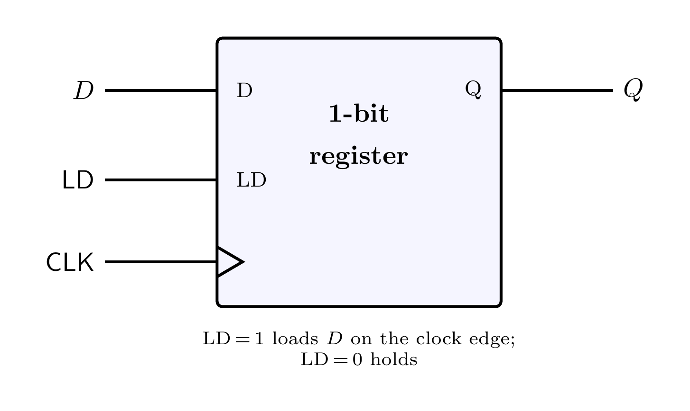
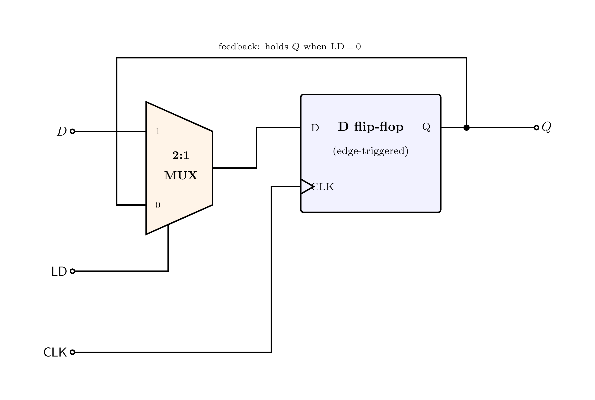
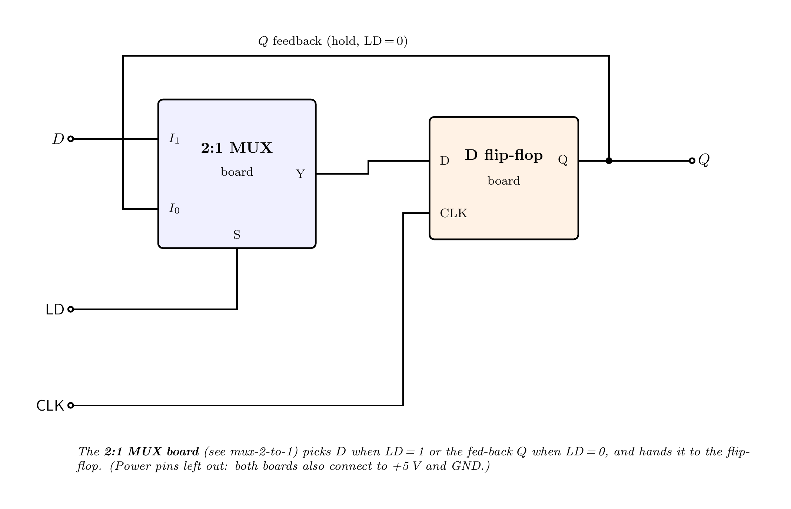

# 1-Bit Register

A **register** is memory that holds a value until you tell it to change. This is the smallest one —
it stores **one bit**. It is a **D flip-flop** with a **load enable** (`LD`) bolted on:

- `LD = 1` → on the next clock edge, the bit **loads** the new data `D`.
- `LD = 0` → the bit **holds** its value (it ignores `D`), even though `CLK` keeps ticking.

That "hold even while the clock runs" behaviour is what makes it a register cell you can drop into a
CPU: the clock goes to *everything*, but each register only changes when *its* `LD` is asserted.

### Symbol



---

## How it works — a load MUX in front of a flip-flop

A bare D flip-flop captures `D` on **every** clock edge. To make it hold, we put a **2:1
multiplexer** in front of it that chooses what the flip-flop actually sees:

```
mux out = LD ? D : Q          (LD picks new data D, or the old value Q fed back)
Q       = D-flip-flop( mux out )  on the clock edge
```

So when `LD = 0` the flip-flop is fed **its own output**, i.e. it reloads what it already had — it
holds. When `LD = 1` it is fed the new `D` — it loads.



That selector is exactly the **[2:1 MUX module](../mux-2-to-1)** — wired with its select `S = LD`,
its `I1 = D` (new data), and its `I0 = Q` (the value fed back). Inside, that MUX is just
`NL = NOT(LD); out = (D AND LD) OR (Q AND NL)`.

---

## Building it on a breadboard

It is now just **two boards**: a **2:1 MUX board** and a **D flip-flop board**.

| Board | Build guide | Count |
|:--|:--|:--:|
| 2:1 MUX | [mux-2-to-1](../mux-2-to-1) | 1 |
| D flip-flop | [flip-flop](../flip-flop) | 1 |



Wire `D` into the MUX's `I1` ("1") input, the fed-back `Q` into its `I0` ("0") input, and `LD` into
its select `S`; the MUX output goes to the flip-flop's `D`, and the shared `CLK` to the flip-flop's
clock. The flip-flop's `Q` is the output **and** the feedback into the MUX. All boards share one
**+5 V** rail and one **GND**.

> The MUX board is itself `1 NOT + 2 AND + 1 OR` boards — see [mux-2-to-1](../mux-2-to-1). So a full
> 1-bit register is `1 D flip-flop + 1 NOT + 2 AND + 1 OR`.

> This is the cell the **8-bit register** repeats eight times — see [register-8bits](../register-8bits).

---

## Standards and references

- *Register (digital) / register with parallel load*, Wikipedia ([wikipedia.org](https://en.wikipedia.org/wiki/Hardware_register)).
- M. M. Mano, *Digital Design*, Pearson (registers, register with load enable).
- D. A. Patterson and J. L. Hennessy, *Computer Organization and Design* (register files).
- T. L. Floyd, *Digital Fundamentals*, Pearson.

---

## Regenerating the diagrams

```bash
pdflatex circuit.tex
pdflatex symbol.tex
pdflatex wiring.tex
pdftoppm -png -r 400 circuit.pdf images/circuit
pdftoppm -png -r 400 symbol.pdf  images/symbol
pdftoppm -png -r 300 wiring.pdf  images/wiring
```
